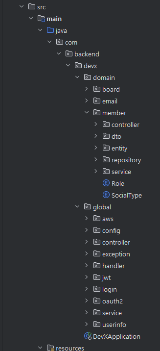

  

<h1>✏️ DevX-Backend</h1>

Spring Boot로 만든 블로그 프로젝트 입니다. 어느 곳에서 사용하며 접할 수 있는 블로그들을 모티브하여 설계하였습니다. 다양한 글을 작성할 수 있는 블로그 웹 PAI 입니다.

  <h2>⚙️ 기술 스택</h2>
  <ul>
    <li>언어: Java</li>
    <li>JDK: 17</li>
    <li>프레임워크: Spring Boot 3.2.3</li>
    <li>ORM: Spring Data JPA</li>
    <li>보안: Spring Security, JWT, Refresh Token, OAuth2 (카카오, 네이버, 구글)</li>
    <li>데이터베이스: AWS S3, MariaDB, Redis</li>
    <li>서버: AWS EC2</li>
    <li>빌드 도구: Gradle</li>
    <li>배포: AWS EC2, Amazon S3, Amazon Route53, AWS 로드 밸런서</li>
  </ul>

  <h2>🛠️ 구조도</h2>
  

  <h2>💡 주요 기능</h2>
  
  

    
회원

    <ul>
      <li>회원가입 및 로그인</li>
      <li>이메일 중복 체크</li>
      <li>JWT 토큰, OAuth2 (카카오, 네이버, 구글) 로그인</li>
      <li>OAuth2 유저 로그인 시 Email 등록을 하면 Token 발급 가능</li>
      <li>로그인 시 Access Token, Refresh Token 발급</li>
      <li>Refresh Token 이용해서 Access Token 재발급</li>
    </ul>
  

  
  

    
이메일 인증

    <ul>
      <li>이메일 인증으로 ID, password 변경</li>
      <li>Email 입력 하면 유효한 유저 인지 확인 후 랜덤 코드 Email 발송</li>
      <li>Email은 Redis 로 유효시간 설정</li>
      <li>Email 이 일치하면 ID를 return</li>
      <li>Email 인증 후 PassWord 변경 가능</li>
    </ul>
  

  
  

    
게시글

    <ul>
      <li>게시글 등록, 수정, 삭제</li>
      <li>이미지 1장 이상 필수 등록</li>
      <li>게시글 이미지는 AWS S3 저장</li>
      <li>본인 글만 삭제 가능 (글 삭제 시 모든 댓글, 좋아요, 이미지 삭제)</li>
    </ul>
  

  
  

    
댓글

    <ul>
      <li>댓글 등록, 수정, 삭제</li>
      <li>댓글 작성 여러개 가능</li>
      <li>본인 글만 수정, 삭제 가능</li>
    </ul>
  

  
  

    
좋아요

    <ul>
      <li>좋아요, 좋아요 취소</li>
      <li>클릭시 좋아요 +1, 한번 더 클릭시 좋아요 -1</li>
      <li>게시글당 한번만 좋아요 가능</li>
    </ul>
  

  

  <h2>📂 패키지 구조</h2>
  

  <h2>🔗 REST API 문서</h2>
  <!-- 추가적인 정보나 링크를 포함할 수 있습니다. -->

  <h2>🔗 ERD</h2>
  <!-- ERD 다이어그램을 여기에 추가할 수 있습니다. -->

  <h2>✍️ 느낀점</h2>
  
README 파일을 작성하는 과정에서 프로젝트의 기능과 기술 스택을 명확히 정리할 수 있어 매우 유익했습니다. 지속적으로 업데이트하여 프로젝트의 발전을 기록할 계획입니다.

