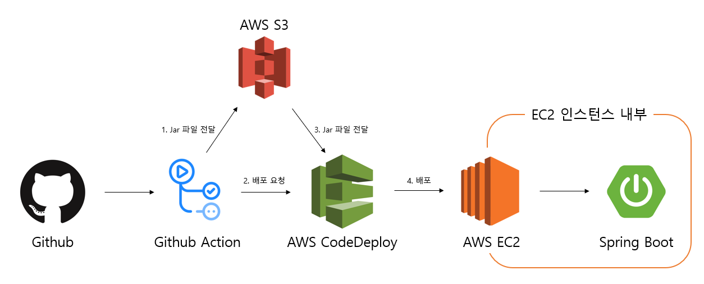

# ✏️ DevX-Backend
Spring Boot로 만든 블로그 프로젝트 입니다.
어느 곳에서 사용하며 접할 수 있는 블로그들을 모티브하여 설계하였습니다.
다양한 글을 작성할 수 있는 블로그 웹 PAI 입니다.

# ⚙ 기술 스택
+ Language: Java
+ JDK: 17
+ Framework: Spring Boot 3.2.3
+ ORM: Spring Data JPA
+ Security: Spring Security, JWT, Refresh Token, OAuth2(카카오, 네이버, 구글)
+ DB: AWS S3, Maria DB, Redis
+ Server: AWS EC2
+ Build Tool: Gradle
+ 배포 스킬: AWS EC2, Amazon S3, Amazon Route53, AWS Load Balancers

# 🛠 구조도

# 💡주요 기능
( ▶ 를 누르면 간략한 기능 설명이 나옵니다. )

회원

- 회원가입 및 로그인
  + 이메일 중복 체크
  + JWT 토큰, OAuth2 (카카오, 네이버, 구글) 로그인
  + OAuth2 유저 로그인시 Email 등록을 하면 Token 발급 가능
  + 로그인 시 Access Token, Refresh Token 발급
  + Refresh Token 이용해서 Access Token 재발급

이메일 인증

- 이메일 인증으로 ID, password 변경
  + Email 입력 하면 유효한 유저 인지 확인 후 랜덤 코드 Email 발송
  + EMail 은 Redis 로 유효시간 설정
  + Email 이 일치하면 ID를 return
  + Email 인증 후 PassWord 변경 가능

게시글

- 게시글 등록, 수정, 삭제
  + 이미지 1장 이상 필수 등록
  + 게시글 이미지는 AWS S3 저장
  + 본인 글만 삭제 가능 ( 글 삭제 시 모든 댓글, 좋아요, 이미지 삭제 )

댓글

- 댓글 등록, 수정, 삭제
  + 댓글 작성 여러개 가능
  + 본인 글만 수정, 삭제 가능

좋아요

- 좋아요, 좋아요 취소
  + 클릭시 좋아요 +1, 한번 더 클릭시 좋아요 -1
  + 게시글당 한번만 좋아요 가능

# 📂 패키지 구조

# 🔗 REST API 문서

# 🔗 ERD

# ✍ 느낀점